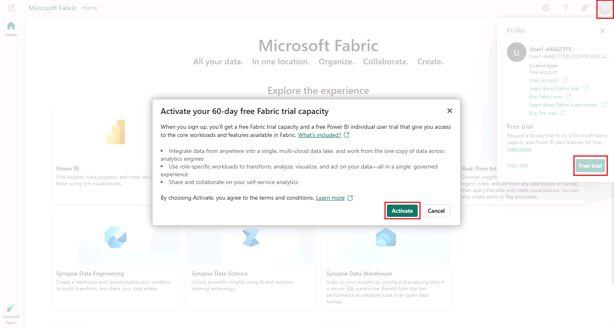

# Session folder

This folder contains the public facing files for the lab `Microsoft Fabric: Start with Real-Time Intelligence`.

# Before you start

> [!TIP]
> As you follow the instructions in this pane, whenever you see a +++icon+++, you can use it to copy text from the instruction pane into the virtual machine interface. This is particularly useful to copy code; but bear in mind you may need to modify the pasted code to fix indent levels or formatting before running it!

## Sign into Windows

1. In the virtual machine, sign into Windows using the following credentials:
    * **User name**: +++@lab.VirtualMachine(Win11-Pro-Base-VM).Username+++
    * **Password**: +++@lab.VirtualMachine(Win11-Pro-Base-VM).Password+++

## Create a trial Teams account

1. In the virtual machine, open Microsoft Teams from the desktop or taskbar.
2. When prompted, sign in using the following credentials:
    * **Email**: +++@lab.CloudPortalCredential(User1).Username+++
    * **Password**: +++@lab.CloudPortalCredential(User1).Password+++
3. Complete the sign up process to create a new account.
4. After signing in to Teams, select **OK** when prompted to stay signed in to all your apps and then select **Done** to complete.
5. Choose **Start Trial** and when prompted allow Teams to be the default app for chats and calls select **Continue**.

## Create a free-tier Fabric account

1. In the virtual machine, open a web browser and browse to +++https://app.fabric.microsoft.com+++.
2. When prompted, sign in using the following credentials:
    * **Email**: +++@lab.CloudPortalCredential(User1).Username+++
    * **Password**: +++@lab.CloudPortalCredential(User1).Password+++
3. Complete the sign up process to create a new account, if asked for a phone number, enter +++555 1234567+++ when prompted. You will see Free license assigned, but you will still need to activate a Free Trial.

## Activate a Fabric trial

1. After signing up for a free Fabric account, in the Fabric portal at +++https://app.fabric.microsoft.com+++, select the **Account Manager** icon (the *user* image at the top right) and in the menu, select **Free trial** and then select **Activate** to start a Microsoft Fabric trial.

2. After the trial has been started, you can continue in the browser session - you will want to remember the **email** and **password** you used to sign up for Microsoft Fabric - you'll need them in the exercises (You can also find your credentials under the **Resources** tab).

## Exercises in this lab

Now you're ready to complete the exercises in this lab using the Fabric trial license you just created. The lab includes multiple exercises, so when you finish one, just move onto the next one. The exercises in this lab are:

* Create an eventhouse in Microsoft Fabric
* Get data in the Real-Time Hub in Microsoft Fabric
* Query streaming data in a KQL queryset in Microsoft Fabric
* Create a Real-Time dashboard in Microsoft Fabric
* Create a Power BI report in Microsoft Fabric

The exercises are designed to be completed in order because they build on the data and resources created in the previous exercises, so make sure you complete each exercise before moving on to the next one.

Don't worry if you run out of time to complete the entire lab. All of these exercises (and more) are available on [Microsoft Learn](https://learn.microsoft.com/fabric/real-time-intelligence/tutorial-introduction). You can also find instructions on [Activating a Fabric trial](https://learn.microsoft.com/en-us/fabric/get-started/fabric-trial) on Microsoft Learn.

Select **Next >** to go to the first exercise.

===

!INSTRUCTIONS [Real-Time Intelligence tutorial part 1: Create Resources](https://raw.githubusercontent.com/microsoft/aitour-get-started-with-fabric/main/lab/tutorial-1-resources.md)

===

!INSTRUCTIONS [Real-Time Intelligence tutorial part 2: Get data in the Real-Time hub](https://raw.githubusercontent.com/microsoft/aitour-get-started-with-fabric/main/lab/tutorial-2-get-real-time-events.md)

===

!INSTRUCTIONS [Real-Time Intelligence tutorial part 3: Query streaming data in a KQL queryset](https://raw.githubusercontent.com/microsoft/aitour-get-started-with-fabric/main/lab/tutorial-3-query-data.md)

===

!INSTRUCTIONS [Real-Time Intelligence tutorial part 4: Create a Real-Time dashboard](https://raw.githubusercontent.com/microsoft/aitour-get-started-with-fabric/main/lab/tutorial-4-create-dashboard.md)

===

!INSTRUCTIONS [Real-Time Intelligence tutorial part 5: Create a Power BI report](https://raw.githubusercontent.com/microsoft/aitour-get-started-with-fabric/main/lab/tutorial-5-power-bi-report.md)

===

!INSTRUCTIONS [Real-Time Intelligence tutorial part 6: Set an alert on your event stream](https://raw.githubusercontent.com/microsoft/aitour-get-started-with-fabric/main/lab/tutorial-6-set-alert.md)

===

!INSTRUCTIONS [Real-Time Intelligence tutorial part 7: Clean up resources](https://raw.githubusercontent.com/microsoft/aitour-get-started-with-fabric/main/lab/tutorial-7-clean-up-resources.md)

## Discussions
Use the Discussion page on this repository to ask any questions or continue the learning conversation!

## Additional Resources and Continued Learning
| Resources          | Links                            | Description |
|-------------------|----------------------------------|-------------------|
| Microsoft Fabric Career Hub        | [Microsoft Fabric Career Hub on the Fabric Community Site](https://aka.ms/FabricCareerHub?ocid=fabric24_careerhub_blog_cxa) | The one-stop location to begin your learning journey for the DP-600: Implementing Analytics Solutions Using Microsoft Fabric certification |
| Hands-on Real-Time Intelligence Applied Skills     | [Implement a Real-Time Intelligence with Microsoft Fabric](https://learn.microsoft.com/en-us/credentials/applied-skills/implement-a-real-time-intelligence-solution-with-microsoft-fabric/) | Validate your technical skills and open doors to new possibilities of advancement with Microsoft Applied Skills |

