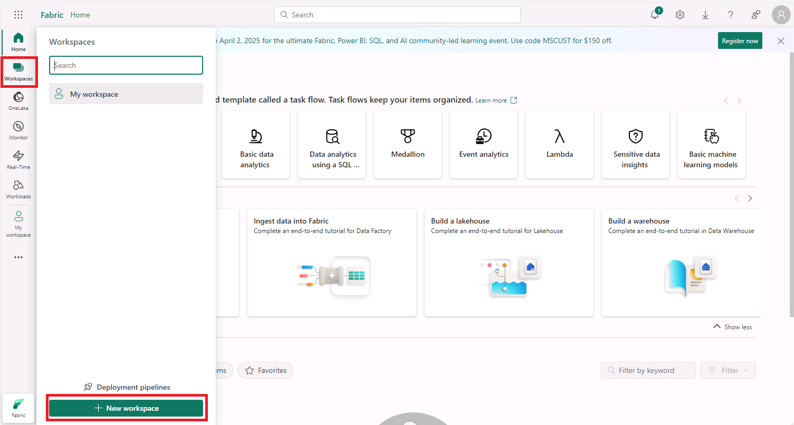
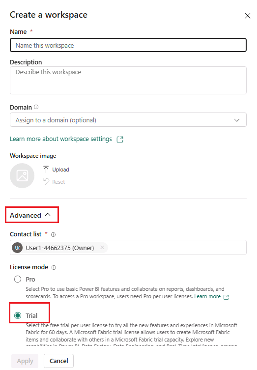
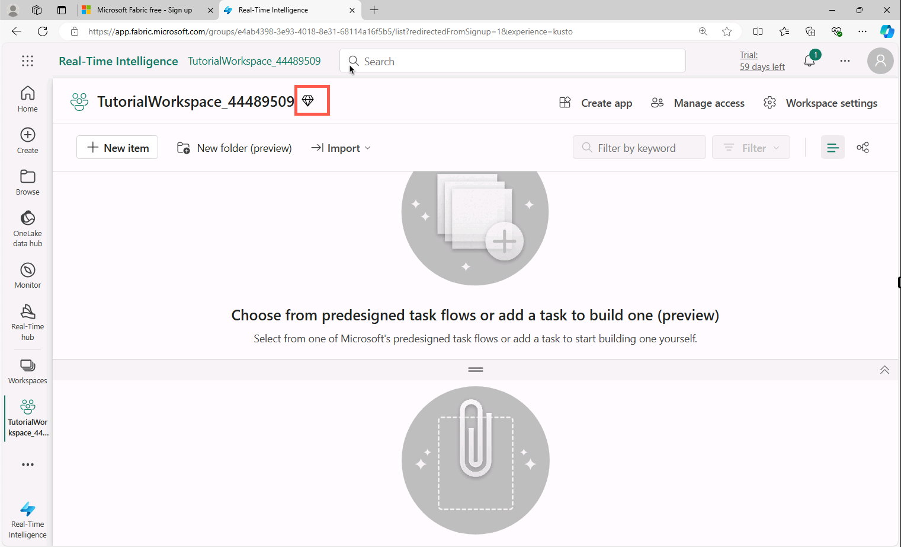
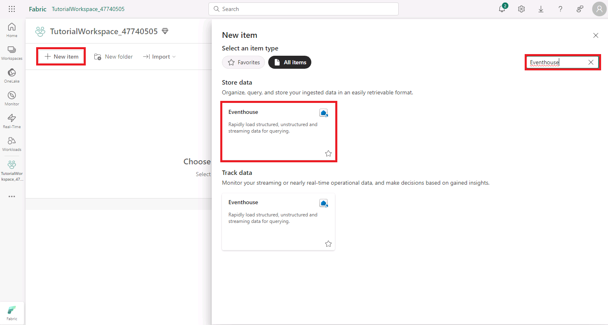

# Real-Time Intelligence tutorial part 1: Create resources

In this part of the tutorial, you set up the environment. Specifically, you create a *workspace* and an *eventhouse*, which automatically creates a child KQL database, and then you enable OneLake availability.

## Create a workspace

1. In the virtual machine, open a web browser and browse to +++https://app.fabric.microsoft.com+++.
2. When prompted, sign in using the following credentials:
    * **Email**: +++@lab.CloudPortalCredential(User1).Username+++
    * **Password**: +++@lab.CloudPortalCredential(User1).Password+++

3. Select **Workspaces** from the left navigation pane. Then select **+ New workspace**.

    

4. Enter a name for the workspace, such as +++*TutorialWorkspace_@lab.LabInstance.Id*+++. Expand the **Advanced** option and make sure **Fabric Capacity** is selected then select **Apply** when done.

    

> [!NOTE]
> **OPTIONAL**: If the Fabric Capacity option is disabled, activate a trial license by selecting the **Account Manager** icon (the user image at the top right) and in the menu, select **Free trial** and then select **Activate** to start a Fabric Trial.   
> 

## Create an eventhouse

1. Browse to the workspace that you just created in the previous step. It will be located in the left hand navigation pane under Workspaces.
2. Ensure that there is a diamond icon next to the workspace name, which indicates that the workspace is associated with a Fabric Capacity.

    

    If the diamond icon is not present, select **Workspace Settings** >  **License Info**. On the License Configuration tile, Select the **Edit**, under License Mode select **Trial**  and finally select *Select License*.

3. In upper left corner select the **+ New item** button. Then search for and select **Eventhouse**.

    

4. Enter +++*Tutorial*+++ as the eventhouse name. A KQL database will be created simultaneously with the same name.

5. Select **Create**. When provisioning is complete, Select **Get started** and the eventhouse **System overview** page is shown.

## Next step

> Select **Next >** in these instructions to go to the next part of the tutorial: Get data in the Real-Time hub.
