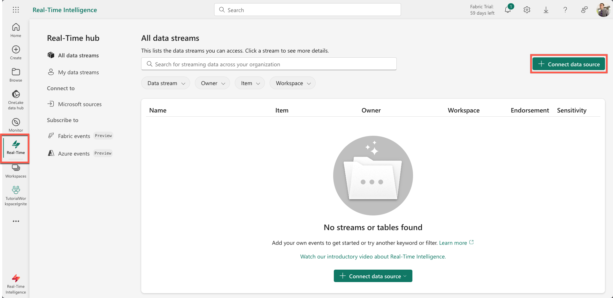
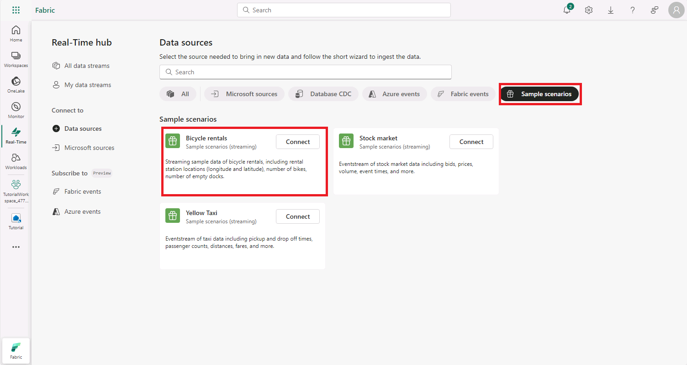
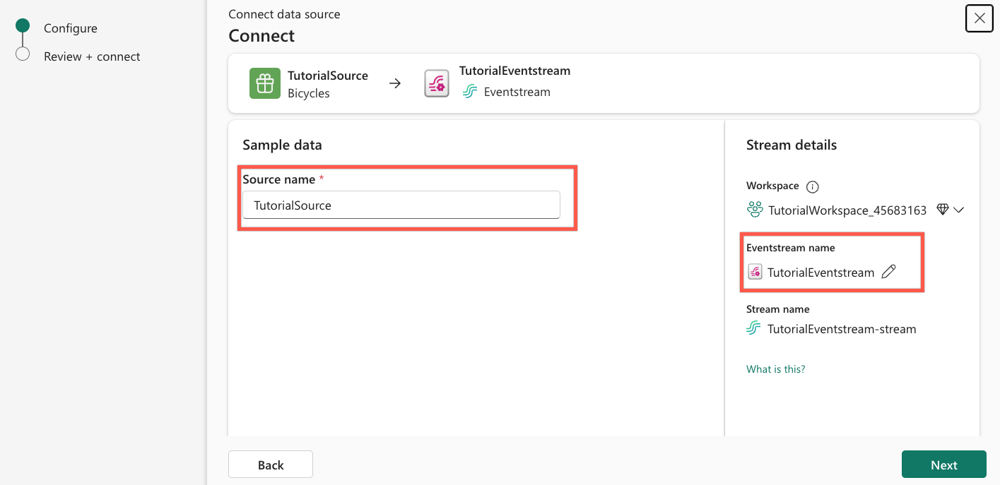
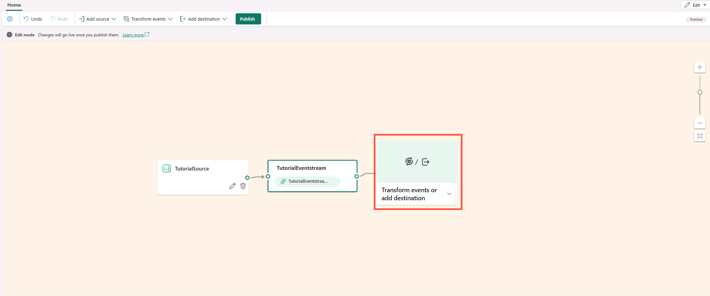
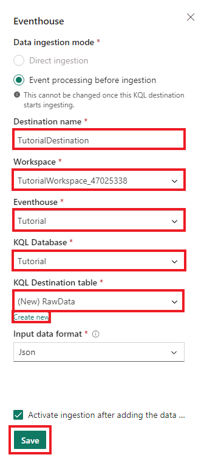
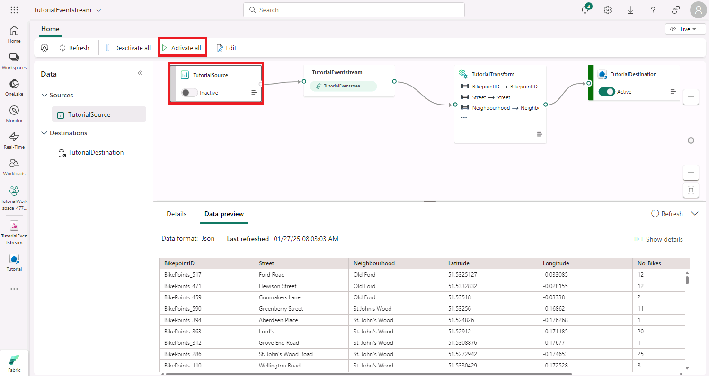

# Real-Time Intelligence tutorial part 2: Get data in the Real-Time hub

In this part of the tutorial, you browse the Real-Time hub, create an event stream, transform events, and create a destination to send the transformed events to a KQL database.

## Create an event stream

1. From the navigation bar, select **Real-Time**. You may get a dialog Welcome to Real-Time hub. Click **Get started** to close the dialog.

2. Select **+ Connect data source**.

   

3. The **Select a data source** pane opens. Select **Connect** in the _Bicycles rentals_ tile.

   

### Sample data

1. In **Source name**, enter +++_TutorialSource_+++.

### Stream details

1. Edit the **Eventstream name** by selecting the pencil icon and entering +++_TutorialEventstream_+++.
2. Select **Next**.

### Review + connect

1. Review the event stream details and select **Connect**.

   A new event stream named _TutorialEventstream_ is created.

## Transform events

1. Select **Open Eventstream** from the notification that appears after creating the event stream, or browse to the event stream from the Real-time hub and select **My data streams**.
2. From the menu ribbon, select **Edit**.
3. In the event stream authoring canvas select the down arrow on the **Transform events or add destination** tile.

   

4. Select **Manage fields**. The tile is renamed to _Manage_fields_.
5. Select the pencil icon on the _Manage_fields_ tile.
6. In the Manage fields pane, do the following actions:

   i. In **Operation name**, enter +++_TutorialTransform_+++.

   ii. Select **Add all fields**.

   iii. Select **+ Add field**.

   iv. From the **Field** dropdown, expand **Built-in Date Time Function** then select **SYSTEM.Timestamp()**.

   v. Enter +++_Timestamp_+++ as the **Name**.

   vi. Select **Add**.

   

7. Select **Save**.
   > [!NOTE]
   > The _TutorialTransform_ tile is now displayed but with an error, because the destination has not been set.

## Create a destination

1. Hover over the right edge of the _TutorialTransform_ tile and select the green plus icon.
2. Select **Destinations** > **Eventhouse**.

   A new tile is created entitled _Eventhouse_.

3. Select the pencil icon on the _Eventhouse_ tile.
4. Enter the following information in the **Eventhouse** pane:

   

   | Field                 | Value                                                        |
   | --------------------- | ------------------------------------------------------------ |
   | **Destination name**  | +++_TutorialDestination_+++                                  |
   | **Workspace**         | Select the workspace in which you've created your resources. |
   | **Eventhouse**        | _Tutorial_                                                   |
   | **KQL Database**      | _Tutorial_                                                   |
   | **Destination table** | _Create new_ - enter +++_TutorialTable_+++ as table name     |
   | **Input data format** | _JSON_                                                       |

5. Select **Save**.
6. From the menu ribbon select **Publish**.

   > [!NOTE]
   > In case you see the Source has been deactivated, as in the screenshot below, select **Activate all** to manually activate the source.

   

The event stream is now set up to transform events and send them to a KQL database. The insights are not yet available to create alerts, you will do this in a later step so you can monitor the number of bikes in real-time. For now, you can move on to the next step to query the data in the KQL database.

## Next step

> Select **Next >** to query streaming data in a KQL queryset
