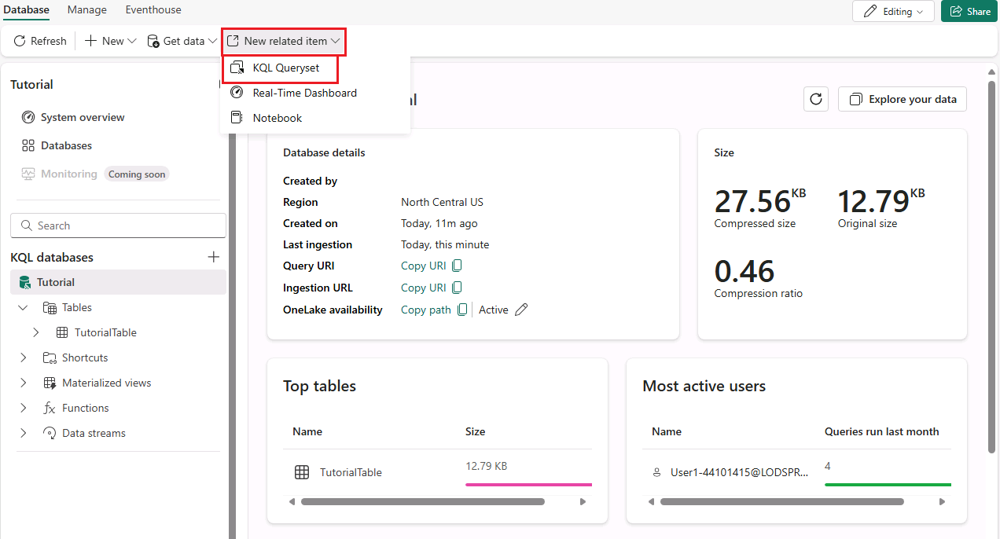
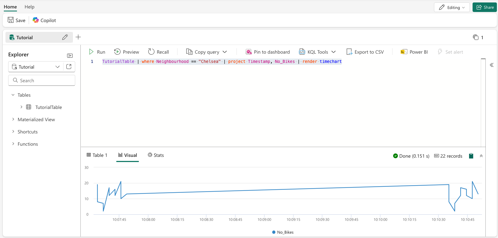

# Real-Time Intelligence tutorial part 3: Query streaming data in a KQL queryset

In this part of the tutorial, you learn how to query your streaming data in a [KQL queryset](https://learn.microsoft.com/en-us/fabric/real-time-intelligence/create-query-set). You create a KQL queryset, write a KQL query, and visualize the data in a time chart.

## Create a KQL queryset

1. From the navigation bar open the KQL database you created in a previous step, named *Tutorial*.
2. Verify that the data is flowing into the database by viewing the **Size** tile in the database details page. The values in this tile should be greater than zero. If the values in the **Size** tile are zero, select **Refresh** from the menu ribbon.
3. From the menu ribbon, select **New related item** and choose **KQL Queryset**.

    

4. Enter the name for the KQL Queryset: *TutorialQueryset* and select **Create**.
5. Select the *Tutorial* database as the data source for the KQL queryset then select  **Connect**
6. Select **Create**.
    A new KQL queryset is created and opens in the KQL Queryset editor. It's connected to the *Tutorial* database as a data source, and is pre-populated with several general queries.

## Write a KQL query

The name of the table you created in a previous step is *TutorialTable*. Use this (case-sensitive) name as the data source for your query.

1. In the query editor, delete the pre-populated queries and enter the following query. Then press **Shift + Enter** to run the query.

    ```kusto
    TutorialTable
    | take 10
    ```

    This query returns 10 arbitrary records from the table. What information about the data can you see at a glance? Notice that one of the columns is named *No_Bikes*. This column contains the number of empty docks at a bike station. This is a field you may be concerned with if you're tracking the availability of bikes at a station.

2. To see the data in a more visual way, use the **render** operator. Run the following query:

    ```kusto
    TutorialTable
    | where Neighbourhood == "Chelsea"
    | project Timestamp, No_Bikes
    | render timechart
    ```

    This query creates a time chart that shows the number of bikes in the Chelsea neighbourhood as a time chart.

    

## Next step

> [Select Next > to create a Real-Time dashboard]()