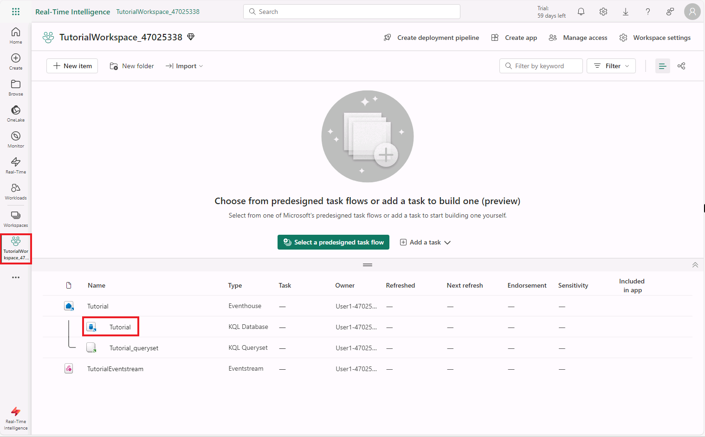
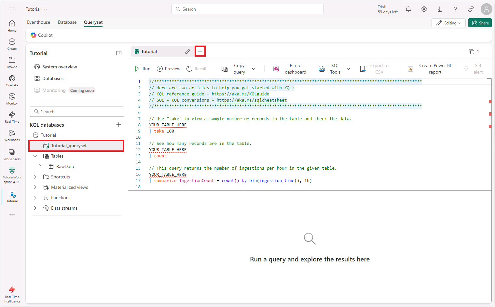

# Real-Time Intelligence tutorial part 3: Transform data in a KQL database

In this part of the tutorial, you learn how to use an update policy to transform data in a KQL Database in Real-Time Intelligence. Update policies are automation mechanisms triggered when new data is written to a table. They eliminate the need for special orchestration by running a query to transform the ingested data and save the result to a destination table. Multiple update policies can be defined on a single table, allowing for different transformations and saving data to multiple tables simultaneously. The target tables can have a different schema, retention policy, and other policies from the source table.

## Move raw data table to a bronze folder

In this step, we will transfer the raw data from the table into a _Bronze_ folder to organize it within the KQL database, following the principles of the Medallion architecture. The _Medallion architecture_ is a data design pattern used to organize data logically. Its goal is to incrementally and progressively improve the structure and quality of data as it flows through each layer of the architecture (from Bronze ⇒ Silver ⇒ Gold layer tables). We will see this in action in this example.

1. On the left side panel select the workspace you created in a previous step, and choose the _Tutorial_ KQL Database.


2. In the database view select the **Tutorial_queryset** and click the **+** button to create a new KQL script. The Real-Time Experience in Fabric uses the _Kusto Query Language (KQL)_ to query and manage your data.  
The most common KQL query is a tabular expression with operators that take a tabular input and return a tabular output. Operators are sequenced by a | (pipe). Data flows, or is piped, from one operator to the next, being filtered or manipulated at each step. Learn more KQL in the [Kusto Query Language (KQL) overview](https://learn.microsoft.com/en-us/kusto/query/) docs.


3. Copy/paste the following code to alter the existing _RawData_ table to be into the _Bronze_ folder.

    ```kusto
    .alter table RawData (
        BikepointID: string,
        Street: string,
        Neighbourhood: string,
        Latitude: dynamic,
        Longitude: dynamic,
        No_Bikes: long,
        No_Empty_Docks: long,
        Timestamp: datetime)
        with (folder="Bronze")
    ```

In case the KQL code does not look as expected, you can use the **KQL Tools** > **Open command palette** > **Format Document** option to autoformat the code.

## Create target table

In this step, you will create a target table that will be used to store the transformed data in a _Silver_ folder.

1. Create a new KQL script and copy/paste the following code to create a new table called **TransformedData** with a specified schema.

    ```kusto
    .create table TransformedData (
        BikepointID: int,
        Street: string,
        Neighbourhood: string,
        Latitude: dynamic,
        Longitude: dynamic,
        No_Bikes: long,
        No_Empty_Docks: long,
        Timestamp: datetime,
        BikesToBeFilled: long,
        Action: string)
        with (folder="Silver")
    ```

2. Run the command to create the table. You should now see a new _Silver_ folder under the **Tables** node in the object tree with a new **TransformedData** table.

## Create function with transformation logic

In this step, you will create a stored function that holds the transformation logic to be used in the update policy. The function parses the _BikepointID_ column and adds two new calculated columns.

1. Create a new KQL script.
2. From the menu ribbon, select **Database**.
3. Select **+New** > **Function**.
4. Edit the function so that it matches the following code, or copy/paste the following code into the query editor. This code creates a new function to parse the _BikepointID_ column and generate two new calculated columns.

    ```kusto
    .create-or-alter function TransformRawData() {
        RawData
        | parse BikepointID with * "BikePoints_" BikepointID: int
        | extend BikesToBeFilled = No_Empty_Docks - No_Bikes
        | extend Action = iff(BikesToBeFilled > 0, tostring(BikesToBeFilled), "NA")
    }
    ```

5. Remove the extra closing curly bracket '}' and run the command to create the function.
    You should now see the function **TransformedRawData** under the **Functions** node in the object tree.

## Apply update policy

In this step, you apply an update policy to the _TransformedData_ table using the stored function _TransformRawData()_ that we created in the previous step.

1. Create a new KQL script.
2. From the menu ribbon, select **Database**.
3. Select **+ New** > **Table update policy**.
4. Edit the policy so that it matches the following code, or copy/paste the following code into the query editor:

    ~~~kusto
    .alter table TransformedData policy update
    ```
    [
        {
            "IsEnabled": true,
            "Source": "RawData",
            "Query": "TransformRawData()",
            "IsTransactional": false,
            "PropagateIngestionProperties": false
        }
    ]
    ```
    ~~~

5. Remove the extra closing square and curly brackets '}]' and run the command to create the update policy.

## Verify transformation

In this step, you verify that the transformation was successful by comparing the output from the source and target tables.

> [!NOTE]
> It might take few seconds to see data in the transformed table.

1. Create a new KQL script and copy/paste the following query to view 10 records from  the _RawData_ source table. Run the query.

    ```kusto
    RawData | take 10
    ```

2. Copy/paste the following query into a new KQL editor to view 10 records from the _TransformedData_ target table. Run the query.

    ```kusto
    TransformedData | take 10
    ```

Notice that the BikepointID column in the target table no longer contains the prefix "BikePoints_".

## Next step

> Select **Next >** to query streaming data in a KQL queryset.
