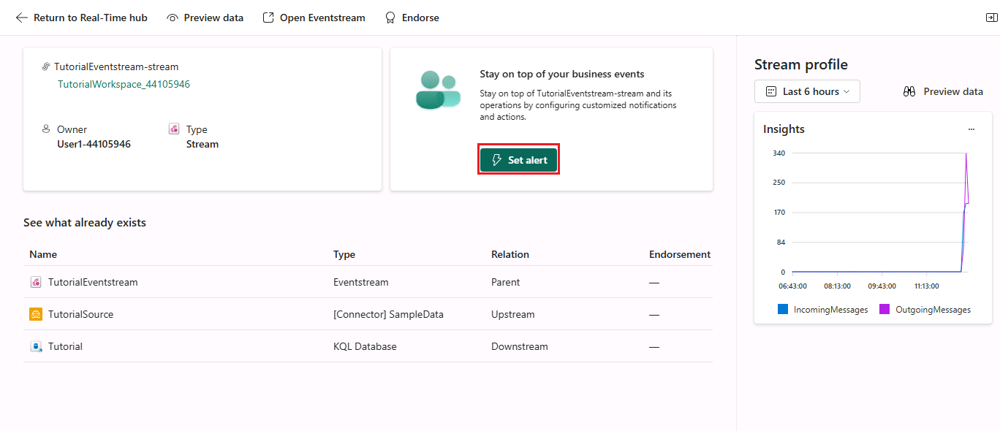

# Real-Time Intelligence tutorial part 6: Set an alert on your event stream

The event stream insights are now available for you to create alerts. In this part of the tutorial, you learn how to set an alert on your event stream to receive a notification in Teams when the number of bikes falls below a certain threshold.

## Set an alert on the event stream

1. From the left navigation bar, select **Real-Time** to open the *Real-Time hub*.
2. Under **All data streams** select the event stream you created in the previous tutorial named *TutorialEventstream*.
    The event stream details page opens.

    

3. Select **Set alert**
4. A new pane opens. Fill in the fields as follows:

    | Field | Value |
    | --- | --- |
    | **Condition** |  |
    | Check | On each event when |
    | Field | No_Bikes |  
    | Condition | Is less than |
    | Value | 5 |
    | **Action** |  **Message me in Teams**
    | **Save location** | |
    | Workspace | The workspace in which you created resources|
    | Item | Create a new item |
    | New item name | +++Tutorial+++ |

    

5. Select **Create**.

    At this point, you have completed the last part of the tutorial. The alert is set and you receive a notification in Teams when the condition is met. This takes some time to trigger the alert so you might want to wait for a few minutes to receive the notification on Microsoft Teams.

## Next step

> Select **Next >** to clean up resources
